# Svelte 分享
## Svelte是什么


它是一个前端的框架，如 *Vue*，*React*。它的作者是前端轮子哥，也是 Rollup 的作者 **Rich Harris**，在2019年弄出来的 。

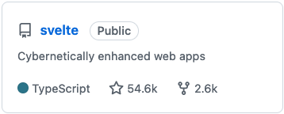

可以看到 *54.6k star* 和 *2.6k Fork* ，这是很热门的一个项目了。再来看看它近几年在前端技术流行度排行怎样？看排行榜可以到 **Bestofjs**[^1]

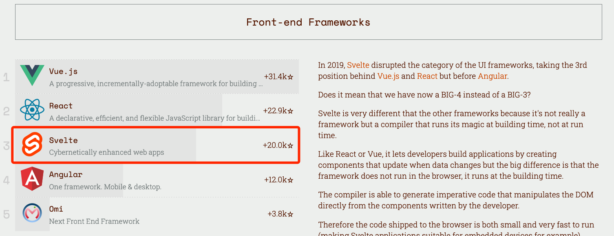<!--
--><center><font color=gray size=2 >2019年度前端框架流行度排行</font></center>

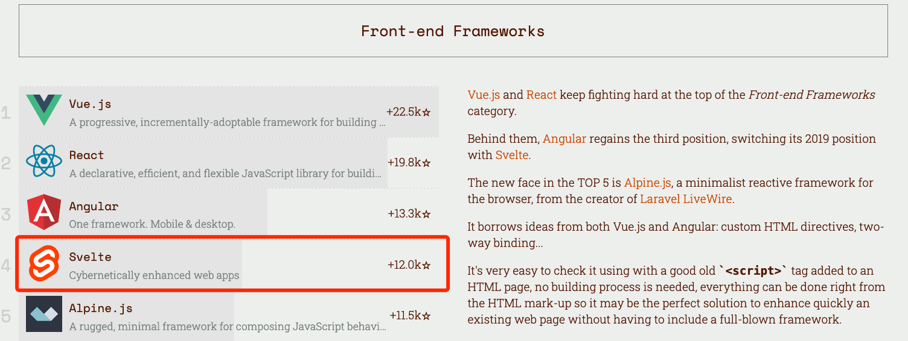<!--
--><center><font color=gray size=2 >2020年度前端框架流行度排行</font></center>

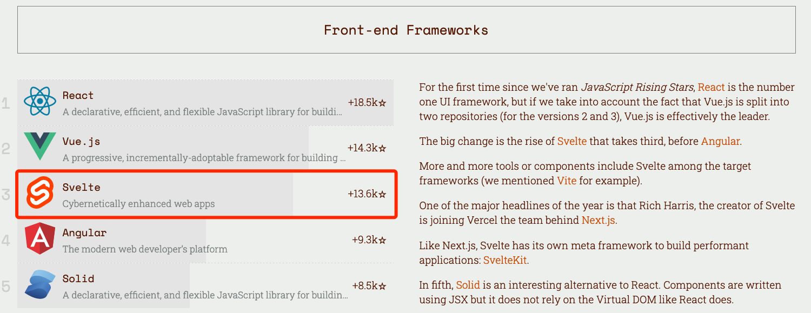<!--
--><center><font color=gray size=2 >2021年度前端框架流行度排行</font></center>


2019年被做出来，至2021年，就一直保持在前五，出道即巅峰！我们也应该了解它，究竟是怎样的框架，它有什么样的特点？

Svelte 在[官网][1]的主要宣传特点，如下三点
-	*Write less code*	（写更少的代码）
-	*No virtual Dom*	（没有虚拟Dom）
-	*Truly reactive*	（真实的反应性）

上面三个点后面再展开说，现在请带着这三个特点往下看。

## Svelte怎样使用
Vue 这样的框架是可以在 html 中引入使用，如下

```html
<script src="https://cdn.jsdelivr.net/npm/vue@2"></script>
<script>
var app = new Vue({
	el: '#app'
})
</script>
```

但是 *Svelte 3.x* 却不行，以前版本可以的。只能用 SFC(Simgle File Component ) + loader + 构建工具(webpack、rollup、vite)，这样方式。文件格式是 `.svelte` 。 

这里用 *Vite* 快捷生成一个项目。

```sh
yarn create vite svelte-demo --template svelte-ts
```

### 最基本用法

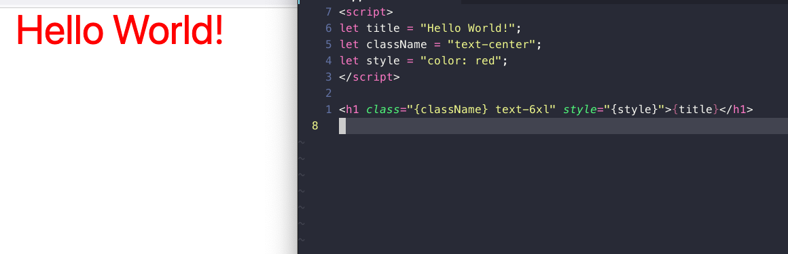

### 循环数组生成 Element、if 条件显示内容、form 表单运用。

 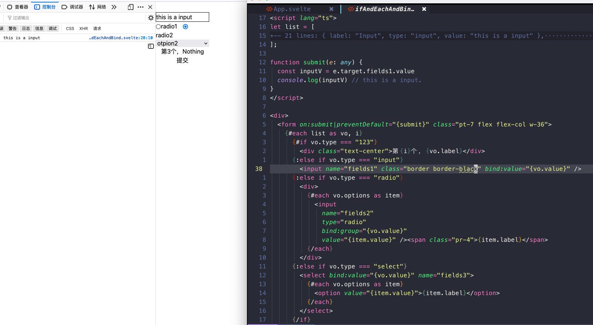
 
### 生命周期、父子组件通信、双向绑定、过渡动画、父级下所有子组件共享上下文、use:action 。

 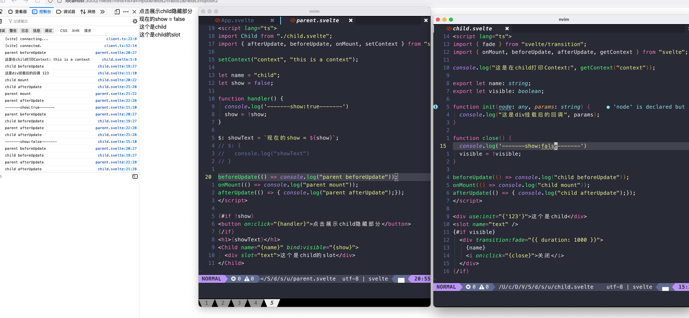
 
### Svelte自带的 Store。

 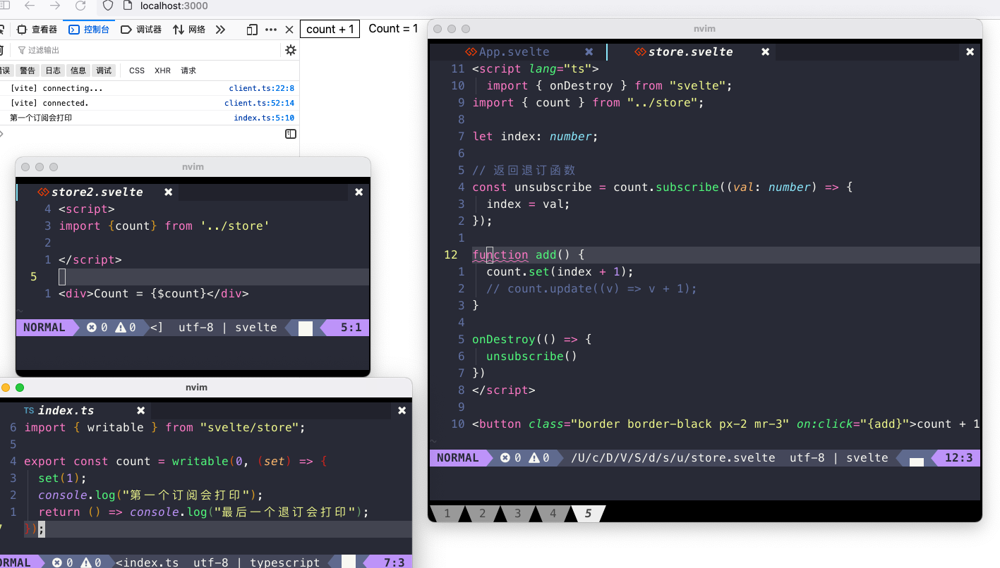
 
看下 build 后的文件，其实也可以用非常规手段，如开头所说的 `new Svelte()`。请看例子。

## 三个特点
看完例子之后，大家对 svelte 的写法都大致了解了。现在结合例子说下三个特点。

###  Write less code
Svelte 和 Vue 一样是使用模版语言(html、css、js)，而不是 React 使用 jsx。就都使用了模版语言的前两者比较，写同样的页面 Svelte 所写的代码少很多。这就是提高工作效率的呀！

### No virtual Dom
从上面看构建后文件，可以看到 Svelte 是直接操作 Dom。回到最开始的方式，所谓武功到达最高境界是返璞归真。所以 runtime code 的体积很小。运行项目不用保存一份虚拟 Dom ，简洁。

这时候会有人疑问直接操作 Dom 性能会好吗？那先想一想，而且虚拟 Dom 真的快吗？虚拟 Dom 的主要作用是与真实 Dom 进行对比，找出需要被修改的节点，快不快主要是看 Dom diff 的算法。下面会有对比图。

### Truly reactive
真实的反应能力。怎样去理解这句话呢。看代码

```javascript
let a = 10, b = 20;
let c = a + b;
console.log(c); // 30
a = 11;
console.log(c); // 还是30，没有变成31
```

现在说的反应性，就是 c 依赖的变量变了， 它也跟着变呢。Vue 用到 `defineProperty` 或 `Proxy`。除了这两个呢？如下

```js
function update() {
	c = a + b
}

a = 11; update();
console.log(c); // 31

b = 10; update()
console.log(c); // 21
```

每次依赖的变量改变，就执行一个 `update函数` 。虽然很蠢，但 Svelte 就是做这样的事。但不是我们去写，在编译时会帮我们处理好的。写 Svelte 时是这样的：

```js
let a = 10, b = 20;
$: c = a + b; // 这里就相当于 Vue 里面的 computed.
```

> : 其实也是 js 的合法语法 - [Label MDN](https://developer.mozilla.org/zh-CN/docs/Web/JavaScript/Reference/Statements/label)

上面说到没有虚拟 Dom ，UI 的变化更新就是像这样会有一个这样的 `update函数` 去操作真实 Dom。

Svelte 就是编译的时候，收集了依赖，实现这些反应性。


## 与其他框架的比较

既然比较就要放在同一规则下，这里介绍两个业界都很出名比较工具。

1. **js-framework-benchmark**[^2]：这是一个针对多个javascript框架的简单基准测试。Github 上 *4.3K ✨* 。
2. **realworld**[^3]： 用不同的技术实现相同功能的应用。Github 上 *63.2k ✨* 。ps: 2021年的未评，先用2020年的评测结果。

### 首次渲染

*js-framework-benchmark*
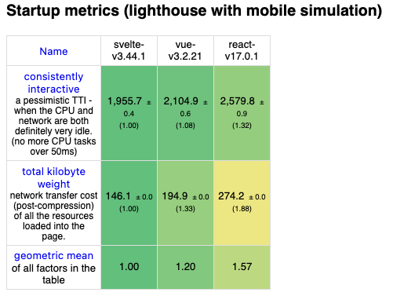

1. consistently interactive - 首次渲染至用户可以操作的时间
2. total kilobyte weight - 网络请求渲染到页面的时间

*realworld*
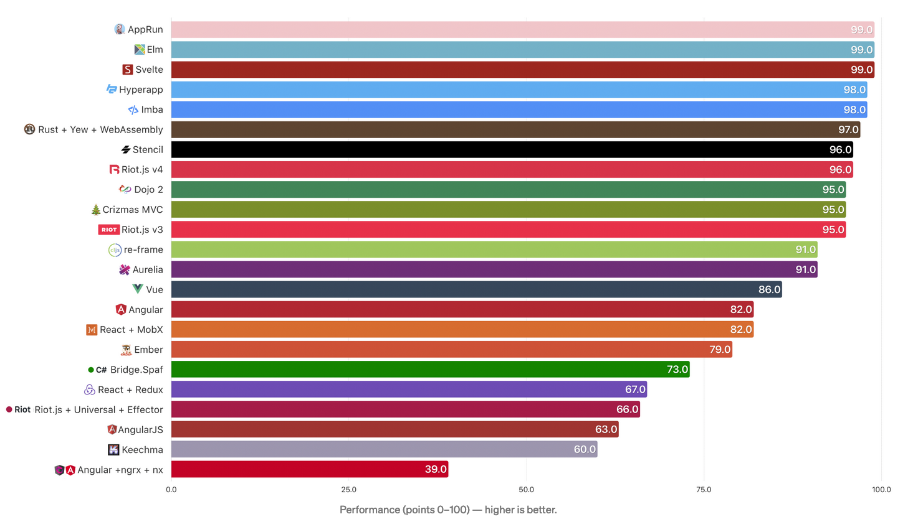

- 分值越高，首次渲染越好。依据：首次渲染至用户可以操作的时间。

### 尺寸大小
这取决于框架的尺寸以及额外依赖的尺寸，还有构建工具精简未使用代码的效率。

*realworld*
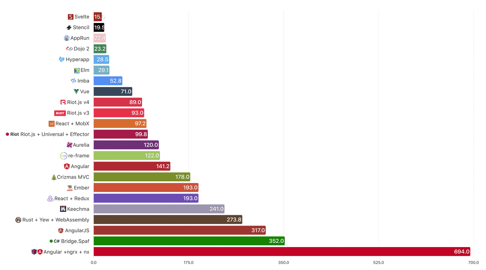

- 文件越小，下载越快，需要解析的内容越少。

### 代码行数

*realworld*
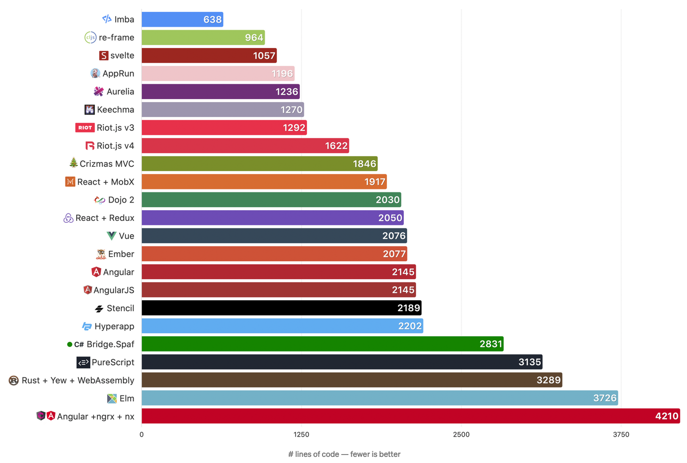

- 行数越少，工作效率就高。

### Dom 的一些操作耗时

*js-framework-benchmark*
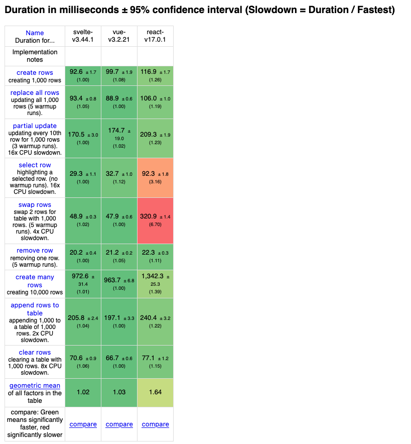

单位：毫秒
1. 创建 1000 行；
2. 更新/替换 1000 行；
3. 有 1000 行，每10行更新；
4. 选中某一行高亮；
5. 在1000行的表中，交换2行位置；
6. 移除一行；
7. 创建10000行；
8. 向有1000行的表加入1000行；
9. 清除有1000行的表。

### 内存使用

*js-framework-benchmark*
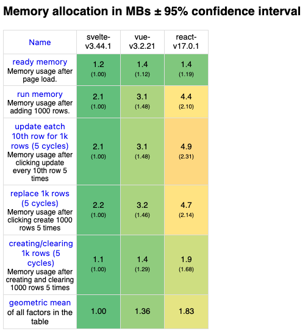

单位：mb
1. 页面加载后的内存使用；
2. 加入1000行后的内存使用；
3. 有1000行，每10行更新5次后内存使用；
4. 创建和清除 1000 行，执行5次后的内存使用。

### Vue3 vs Svelte

Evan You 也亲自下场，用它们去实现规范标准的功能，然后构建，压缩，得出尺寸大小比较

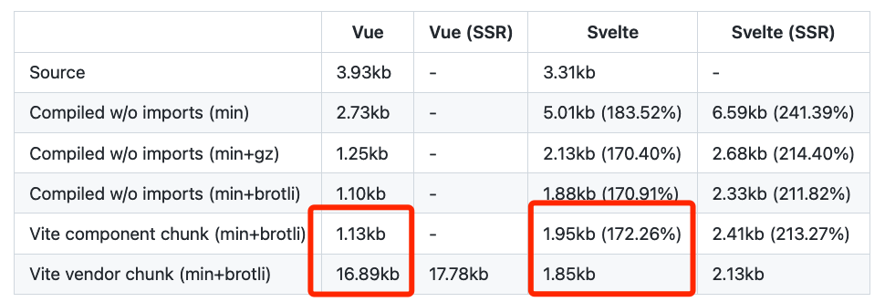

从上图看可以看出，框架运行时的代码，Svelte真的很小，但单个组件的尺寸会比较大。

如果把框架的尺寸看成常量，那么组件的数量有个阀值 Vue3 和 Svelte 的尺寸大致一样；组件数量超过阀值，Svelte 总体的尺寸会大；反之，Vue3 的大。

Svelte 是注重编译环节的，运行时的代码是很小很小。而 Vue 是注重运行时，所以运行时代码很大。相对的，但Svelte单页面的文件会比 Vue 的大。这两种框架实现方式并没有谁好谁坏，是两个不同分支走向。

## Svelte的应用场景

先讲下 Svelte 的一些生态，没有官方的路由库，有个社区版 **[svelte-spa-router](https://github.com/ItalyPaleAle/svelte-spa-router)** ， UI组件库挺多，状态管理自带。用它做一个项目，肯定是没问题的。

从上面的比较，可以看得出 Svelte 不太合适做大型项目，合适做一些官网、活动页之类的小页面，性能杠杠的。同时在客户端做 SEO 不行，现流行框架的通病，可以用 Svelte 的 SSR。


## 参考
1. [Svelte 中文官网][1]
2. [Svelte Github Repository](https://github.com/sveltejs/svelte)
3. [2021 JavaScript Rising Stars](https://risingstars.js.org/2021/en)
4. [A RealWorld Comparison of Front-End Frameworks 2020 - 中文译文](https://zhuanlan.zhihu.com/p/135823505)
5. [Results for js web frameworks benchmark - official run](https://krausest.github.io/js-framework-benchmark/current.html)
6. [vue-svelte-size-analysis by 尤雨奚](https://github.com/yyx990803/vue-svelte-size-analysis)
7. [我对Svelte的看法 by Randy](https://lutaonan.com/blog/svelte/)
8. [Best Svelte UI Library 2022](https://themeselection.com/best-svelte-ui-library/)

%%脚注%%

[^1]: [**Bestofjs**](https://github.com/bestofjs) - The best of JavaScript and the web platform
[^2]: [**js-framework-benchmark**](https://github.com/krausest/js-framework-benchmark) - This is a simple benchmark for several javascript frameworks. The benchmarks creates a large table with randomized entries and measures the time for various operations including rendering duration.
[^3]: [**realworld**](https://github.com/gothinkster/realworld) - 用不同的技术实现相同功能的应用。常用来练手 Demo。

%%reference%%

[1]: https://www.sveltejs.cn/

